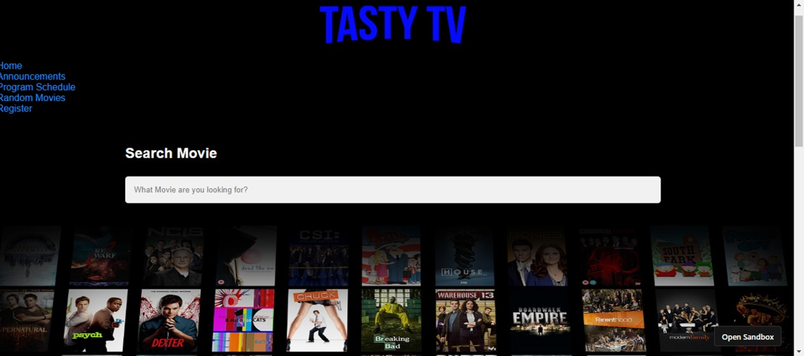
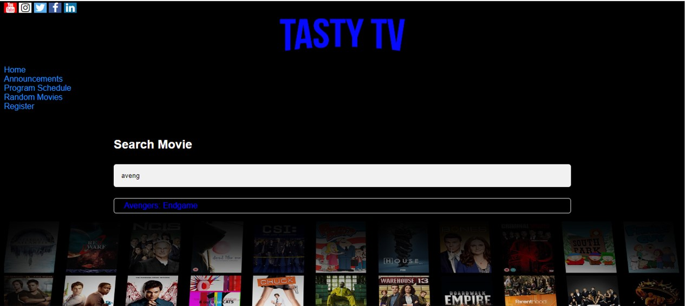
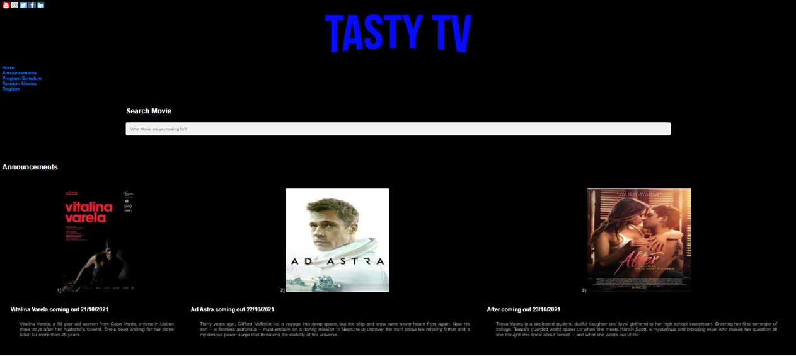
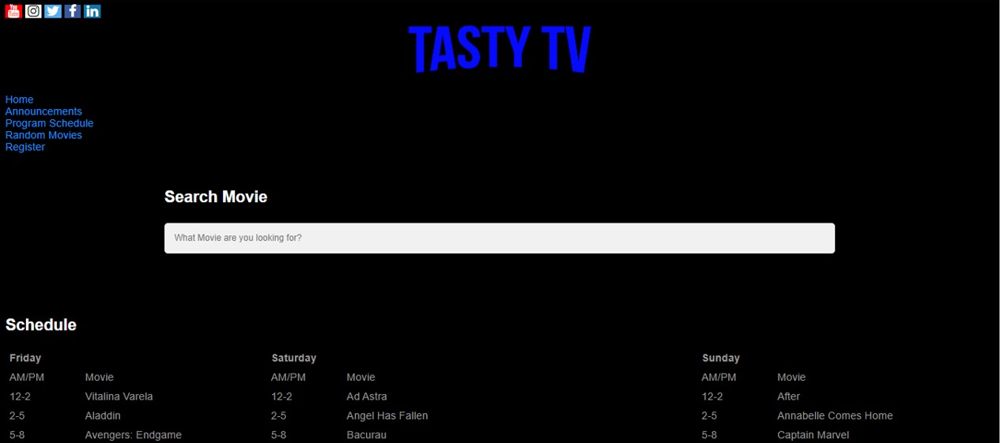
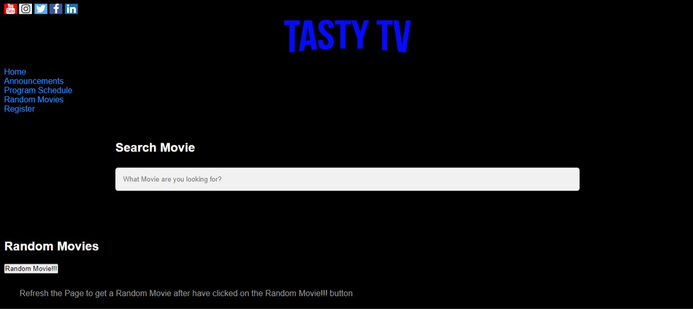
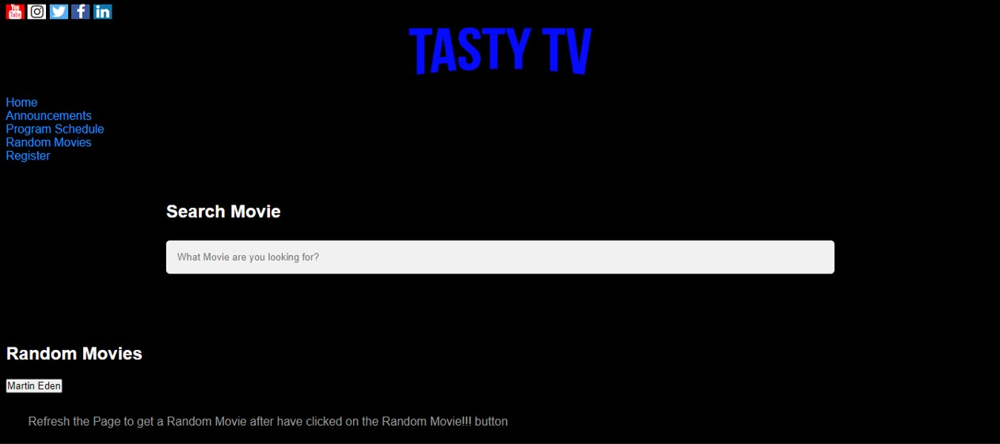
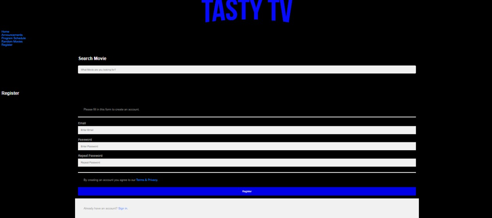

# TASTY TV project (JO)

> Promotional website for movie and tv show live-streaming service called Tasty TV

> Live demo [_click here_](https://4pzh78.csb.app/index.html).

## Table of Contents

- [General Info](#general-information)
- [Technologies Used](#technologies-used)
- [Development Process](#development-process)
- [Features](#features)
- [Screenshots](#screenshots)
- [Setup](#setup)
- [Usage](#usage)
- [Project Status](#project-status)
- [Room for Improvement](#room-for-improvement)

## General Information

- Project is a promotional website for a movie and TV show live-streaming service, "TastyTV". The website shows announcements of the TV and Movies available on the service. It also has the programming schedule of the “TastyTV” live-streaming service, which is every day with a 12-hour repeating stream. There is also on the website a page to select a random movie from our selection of movies. Lastly, the website has links to “TastyTV”'s social media accounts on YouTube, Instagram, Twitter, Facebook, and LinkedIn.

## Technologies Used

- HTML
- CSS
- JavaScript
- CodeSandbox: Instant Cloud-Based IDE

## Development Process

- Below is my problem-solving strategy for this project.
- Firstly I read the project's/client's brief on what type of website they needed.
- Then I created multiple wireframes, to plan how I would like the website design to be and what operations the website would have.
- Then I used Code Sandbox to code the webpages using HTML, CSS and JavaScript.
- The layout of each webpage was easy for me to code, but what I struggled on before finally getting there, was how to make the code, such that I could print on the screen a random movie name from the array of objects.
- I used websites: Youtube, Stack Overflow,Codewars and I also used my lecture notes to help me create a fully functional random movie generator from the list of movies provided in the array of objects from the client's data.

## Features

- On the TastyTV website there is a sub-page called Random Movies. On that sub-page there is a button named Random Movie!!!, which when you click on that button a random movie name appears from TastyTV's selection of movies.
- On the TastyTV website there is are social media button icons link for each social media TastyTV have including YouTube, Instagram, Twitter, Facebook and LinkedIn.
- On the middle of every page for the TASTYTV website there is a search bar which allows the user to type in the movie they want watch from the library of movies avaiable fot TASTYTV.

## Screenshots

## Setup

To setup the project head to codesanbox.io the CodeSandbox: Instant Cloud-Based IDE and then click on the website new sandbox and then click on static HTML. This will open a basic HTML and you can edit this with your own HTMl5 boilerplate.

## Usage

The user can access the TASTYTV website with the following. Firstly each page has a search bar where you type in the name of the movie you want to see. There are different icons to click on to visit the various TASTYTV social media.

- Home page shows what TASTYTV is a movie/tv show streaming website
- Announcement page shows what movie/tv shows are newly released to TASTYTV.
- Program schedule page shows the schedule of movie/tv show available on TASTYTV.
- Registration page allows the user to put their contact details down to register for TASTYTV.
- Random Movies page allows the user to click a button for a Random Movie with the name of that movie appearing on the screen.

Provide various use cases and code examples here.

##### Snippet of code to search a TV Show or Movie on TASTY TV's library

`
 <h2>Search Movie</h2> <input id="searchbar" autocomplete="off" onkeyup="search()" type="text"\n name="search" placeholder="What Movie are you looking for?"> 

 
`

##### Snippet of code for Registration page

`<main>`
`<form action="action_page.php">`
`
`
`
Please fill in this form to create an account.
`
`<hr`
`<label for="email"><b>Email</b></label>`
`<input type="text" placeholder="Enter Email" name="email" id="email"` `required>`
`<label for="psw"><b>Password</b></label>`
`<input type="password" placeholder="Enter Password" name="psw" id="psw"` `required>`
`<label for="psw-repeat"><b>Repeat Password</b></label> <input type="password" placeholder="Repeat Password" name="psw-repeat" id="psw-repeat" required> 
`
`
By creating an account you agree to our <a href="#">Terms & Privacy</a>.
`
`<button type="submit" class="registerbtn">Register</button>`
`
`
`
`
`
Already have an account? <a href="#">Sign in</a>.
`
`
`
`</form>`
`</main>`

##### Snippet of code to select a random movie from an array of objects in the random movie page where you press the random movie button and a random movie shows on the screen.

`function getRandomMovie(listOfMovies) {`
`const randomIndex = Math.floor(Math.random() * listOfMovies.length);`
`const item = listOfMovies[randomIndex];`
`return item; }`

## Project Status

Project is: _complete_

## Room for Improvement

- My JS file prints out an ordered array of each movie TASTYTV shows. I would like that array to be arranged and displayed for a programming schedule table on the schedule HTML page. I have been able to link a function on my JS file to print out a random movie and link that movie to be print out on my random movie HTML page but I have not been able to link JS for each movie for the schedule HTML page.

* I would like each time the user clicks the random movie button for a new random movie to be printed on the screen, without having to press refresh on the page,to then press again the random movie button to get a new random movie.
